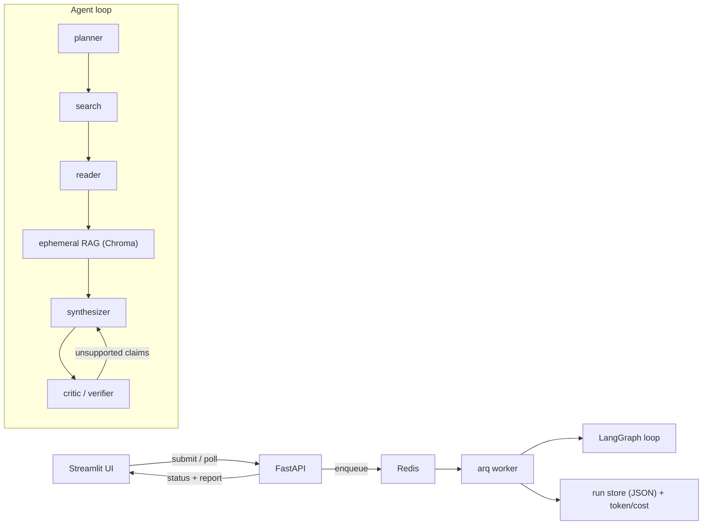

# 🔎 DeepResearch

[](https://github.com/aman7251/deepresearch/actions/workflows/ci.yml)
[](LICENSE)

An autonomous, multi-agent research assistant with a **fact-checking verifier**.

Ask a hard question (e.g. *"Compare the 2025 EU and US approaches to AI regulation"*).
The system decomposes it, spawns a chain of sub-agents
(**planner → web-search → reader → synthesizer → critic/verifier**), builds an
**ephemeral RAG index** over the pages it fetches, and writes a **cited report**.

The standout piece is the **critic/verifier sub-agent**: it fact-checks *every claim*
against its sources and labels each one `supported` / `unsupported` / `contradicted`
with a confidence score — a hallucination guardrail *inside* the agent loop. It also
ships with an **evaluation + red-team harness** and **token/cost observability**.

> 100% open-source / free stack. Runs locally with a free Groq key or a local Ollama
> model. A built-in **demo mode** lets the UI run with **zero API keys**.

---

> New here? [EXPLAINER.md](EXPLAINER.md) is a deep, glossary-backed walkthrough of what the
> project does, the full architecture, and every minute detail.
> Short on time? [CHEATSHEET.md](CHEATSHEET.md) is the one-page fast-review version.

## Why it stands out

- **Multi-agent self-correction** (critic loop), not single-shot prompting.
- **Inline citations + per-claim confidence** = visible verifiability.
- **Built-in eval + red-team** harness (faithfulness, citation coverage, prompt-injection suite).
- **Cost/latency observability** surfaced in the UI.
- Correct production shape: long agent loops run in a **queue + worker**, never inside an HTTP request.

## Architecture



## Stack

| Layer | Choice |
|---|---|
| Orchestration | LangGraph (+ `deepagents`-compatible, model-agnostic) |
| LLM | **Groq** free tier (default) or **Ollama** (local) — both OpenAI-compatible |
| Web search | `ddgs` (DuckDuckGo metasearch, no key) |
| Reader | `httpx` + `trafilatura` |
| RAG | embedded **Chroma** + `sentence-transformers` (BGE) |
| API / queue | FastAPI + Redis + `arq` worker |
| UI | Streamlit (citations, flagged claims, cost/latency) |
| Eval | faithfulness + citation coverage + prompt-injection red-team |

---

## Quickstart

One-command setup (creates venv, installs deps, writes `.env`):

```bash
bash scripts/setup.sh                                   # macOS / Linux
# Windows: powershell -ExecutionPolicy Bypass -File scripts\setup.ps1
```

### Option A — demo mode (no keys, no Redis)
```bash
pip install -r requirements.txt
cp .env.example .env          # then set DEMO_MODE=1
streamlit run app/ui_streamlit.py
```

### Option B — live research (local)
1. Get a free Groq key at <https://console.groq.com/keys> (or install [Ollama](https://ollama.com)).
2. Configure `.env`:
   ```bash
   cp .env.example .env
   # set LLM_PROVIDER=groq and GROQ_API_KEY=...   (or LLM_PROVIDER=ollama)
   # set DEMO_MODE=0
   ```
3. Start Redis (e.g. `docker run -p 6379:6379 redis:7-alpine`), then in three terminals:
   ```bash
   uvicorn app.api:app --reload --port 8000      # API
   arq app.worker.WorkerSettings                 # worker
   streamlit run app/ui_streamlit.py             # UI -> http://localhost:8501
   ```

### Option C — everything via Docker
```bash
cp .env.example .env          # set GROQ_API_KEY (or use the ollama profile)
docker compose up --build
# UI:  http://localhost:8501   API docs: http://localhost:8000/docs
# Local models instead:  docker compose --profile ollama up --build
```

## CLI / eval

```bash
python -m app.agents "What are the differences between HTTP/2 and HTTP/3?"  # one-shot run
python -m eval.run_eval         # faithfulness + citation-coverage scoreboard -> eval/results.md
python -m eval.redteam          # prove the verifier blocks injected falsehoods
```

## Project layout

```
app/
  config.py        # env-driven settings
  llm.py           # OpenAI-compatible client + token/cost tracker
  tools.py         # ddgs web search + page reader
  rag.py           # ephemeral Chroma index
  agents.py        # LangGraph: planner->search->reader->synth->critic
  api.py           # FastAPI (enqueue + status)
  worker.py        # arq worker (runs the loop off the request path)
  store.py         # JSON run store
  ui_streamlit.py  # UI
eval/              # eval + red-team harness
samples/           # cached demo run for demo mode
```

See [DEPLOY.md](DEPLOY.md) for free hosting options (Hugging Face Spaces, cloudflared tunnel).

## Testing

The full agent loop is tested **offline** — the LLM, web search, page reader and vector
index are replaced with deterministic fakes, so tests need no API keys or network:

```bash
pip install -r requirements-dev.txt
pytest          # unit + end-to-end loop tests
ruff check .    # lint
```

CI runs lint + tests on every push (see [.github/workflows/ci.yml](.github/workflows/ci.yml)).

For Hugging Face Spaces, the top-level [app.py](app.py) is the entrypoint (`streamlit run app.py`).

## License

MIT.
